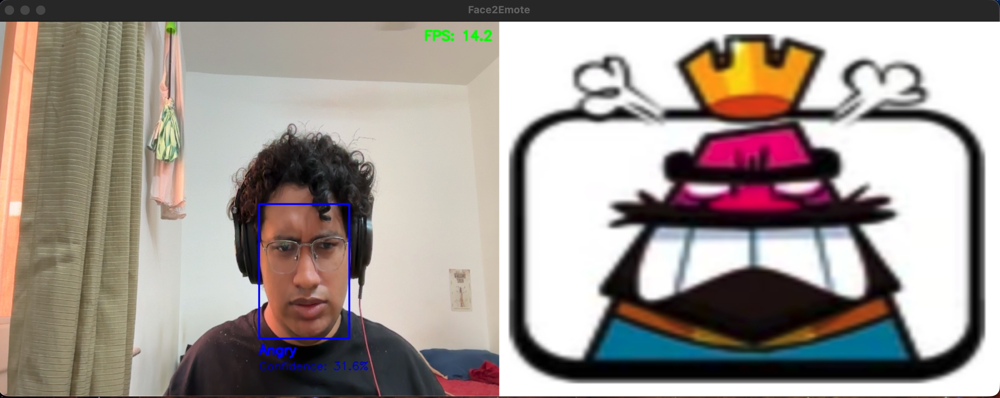

# Face2Emote

**Face2Emote** is a real-time emotion and gesture recognition system that detects your facial expressions and hand gestures using a webcam, then displays the corresponding emoji and plays matching sound effects!

## Screenshots

<p align="center">
  
</p>

<p align="center">
  
  
</p>

## Features

**Real-time emotion detection** using a trained CNN model
**Hand gesture recognition** (e.g., ✌️ peace, 👍 thumbs-up)
**Dynamic emoji display** alongside the video feed
**Audio feedback** that plays corresponding sounds
**FPS counter** for performance monitoring

## Tech Stack

| Component               | Technology         |
| ----------------------- | ------------------ |
| **Camera & Display**    | OpenCV             |
| **Emotion Recognition** | TensorFlow / Keras |
| **Hand Tracking**       | MediaPipe Holistic |
| **Audio**               | Pygame             |
| **Language**            | Python             |


## Installation

Make sure you have Python **3.12+** and `pip` installed.

```bash
git clone https://github.com/<yourusername>/Face2Emote.git
cd Face2Emote
pip install -r requirements.txt
```

## Usage

Run the app:

```bash
python main.py
```

Controls:

* Press **Q** to quit the window.
* Keep your **face visible** to detect emotion.
* Make a **gesture** (✌️ peace / 👍 thumbs-up) to trigger special emojis and sounds.


## Example Behavior

| Action            | Result                                  |
| ----------------- | --------------------------------------- |
| 😊 Smile          | Shows “Happy” emoji + plays “happy.mp3” |
| 😢 Frown          | Shows “Sad” emoji + plays “sad.mp3”     |
| ✌️ Peace sign     | Displays “Peace” emote and sound        |
| 👍 Both thumbs up | Shows “Thumbs” emote and sound          |


## FPS Display

The live FPS counter is shown at the top-right corner of the video feed.
Emotion name and confidence (in %) are displayed below the red bounding box.
